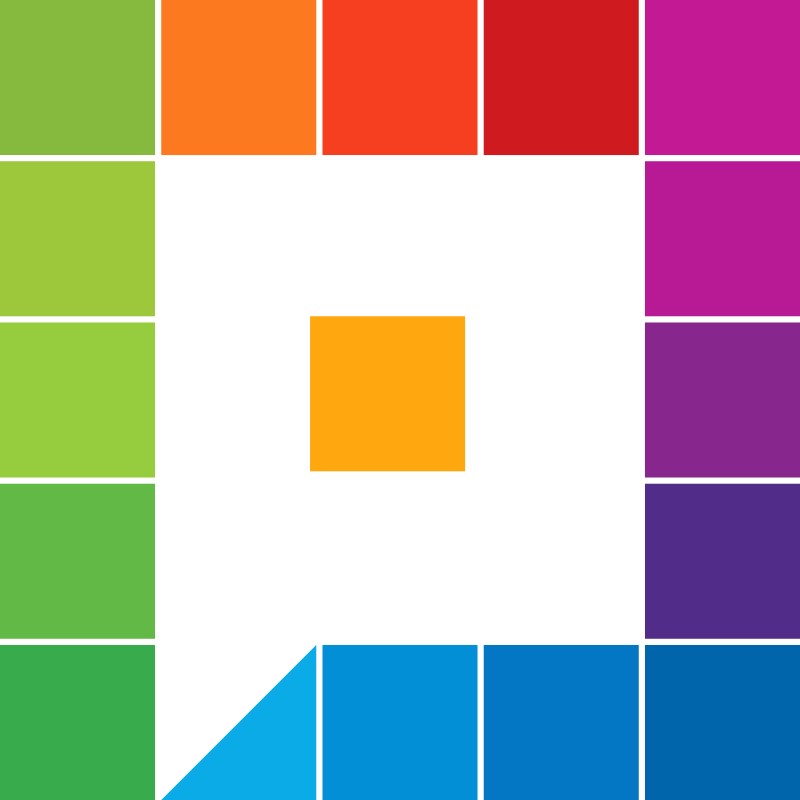

<h1 align="center">
  <br>
  <a href=""></a>
  <br>
  Picket
  <br>
</h1>

<h4 align="center">Screen color picker for linux with magnifier and custom/user defined formats.</h4>

<p align="center">
  <a href="#features"> Features</a> •
  <a href="#authors">Authors</a> •
  <a href="#license">License</a>
</p>

# Main Window


## Features

* [Magnifier](#Magnifier): Zoom in on particular pixels
* [Precision](#Precision): Pixel precision selection
* [CustomFormat](#CustomFormat): Custom color format output
* [FormatEditor](#FormatEditor): Format editor
* [Variables](#Variables): Multiple variables for format output creation
* [Settings](#Settings): Usefull settings like start immediate pick and quit after pick
* [Shortcuts](#Shortcuts): Shortcuts

### Magnifier


### CustomFormat

All the formats are stored in the directory {home}/.picket in the file formats.txt
Color Formats consist of two components:
1. [xxxx] - A unique indetifier
2. xxxxxx... - The actual string that will be copied to the clipboard
#### Example
> [RGB]$r$, $g$, $b$

output:

> 150, 250, 75

Lines that do not start with a `[` character are ignored and can be used like comments

### FormatEditor

Simple Format Editor


### Variables

| Variable     | Description                          |
| ------------ | ------------------------------------ |
| $r$          | Red 0-255                            |
| $g$          | Green 0-255                          |
| $b$          | Blue 0-255                           |
| $a$          | Aplha 0-255                          |
| $r_d$        | Red as double 0.0 - 1.0              |
| $g_d$        | Green as double 0.0 - 1.0            |
| $b_d$        | Blue as double 0.0 - 1.0             |
| $a_d$        | Alpha as double 0.0 - 1.0            |
| $r_hex$      | Red as hex 00 - FF                   |
| $g_hex$      | Green as hex 00 - FF                 |
| $b_hex$      | Blue as hex 00 - FF                  |
| $a_hex$      | Alpha as hex 00 - FF                 |
| $h$          | Hue                                  |
| $s$          | Saturation in %                      |
| $l$          | Lightness in %                       |
| $s_d$        | Saturation as double                 |
| $l_d$        | Lightness as double                  |
| $c$          | Cyan 0-100                           |
| $m$          | Magenta 0-100                        |
| $y$          | Yellow 0-100                         |
| $k$          | Key 0-100                            |
| $c_d$        | Cyan as double 0.0 - 1.0             |
| $m_d$        | Magenta as double 0.0 - 1.0          |
| $y_d$        | Yellow as double 0.0 - 1.0           |
| $k_d$        | Key as double 0.0 - 1.0              |

### Settings


Useful settings:
* __Start immediate pick__ - Starts the picking process when the application starts
* __Copy to clipboard after pick__ - Copies the selected format to clipboard after the pickcing process finished
* __Quit after pick__ - Quits the application after the picking process finishes

## Shortcuts
### MainWindow

| Key                                 | Description                         |
| ----------------------------------- | ----------------------------------- |
| <kbd>SPACE</kbd> or <kbd>p</kbd>    | Starts the picker                   |
| <kbd>TAB</kbd>                      | Copies the format to the clipboard  |
| <kbd>q</kbd>                        | Quit. Exit application.             |
| <kbd>1...9</kbd>                    | Quick format selection              |

### Picker

| Key                                   | Description                         |
| -----------------------------------   | ----------------------------------- |
| <kbd>up arrow</kbd> or <kbd>w</kbd>   | Move up                             |
| <kbd>down arrow</kbd> or <kbd>s</kbd> | Move down                           |
| <kbd>left arrow</kbd> or <kbd>a</kbd> | Move left                           |
| <kbd>right arrow</kbd> or <kbd>d</kbd>| Move right                          |
| <kbd>e</kbd> or <kbd>+</kbd>          | Increase magnifier size             |
| <kbd>q</kbd> or <kbd>-</kbd>          | Decrease magnifier size             |
| <kbd>ESC</kbd>                        | Cancel pick                         |

## Packages
Arch User Repositories https://aur.archlinux.org/packages/picket/

## Manual Install

Clone the repository to your local machine.
Execute `make` to build the program and `sudo make install` to install it on your machine.

```shell
  git clone https://github.com/rajter/Picket.git
  cd Picket
  make
  sudo make install
```
### Prerequisites

* [GCC](https://gcc.gnu.org/) - GNU Compiler
* [Gtkmm](https://www.gtkmm.org/en/) Gtkmm - GTK+ wrapper for c++

## Built With

* [mINI](https://github.com/pulzed/mINI) - tiny, header only C++ library for manipulating INI files
* [Glade](https://glade.gnome.org/) - Glade user interface designer

## Authors

* **Andrija Rajter** - *Initial work* - [rajter](https://github.com/rajter)

## License

This project is licensed under the MIT License - see the [LICENSE](LICENSE) file for details
